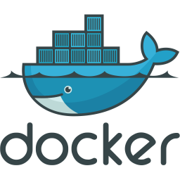
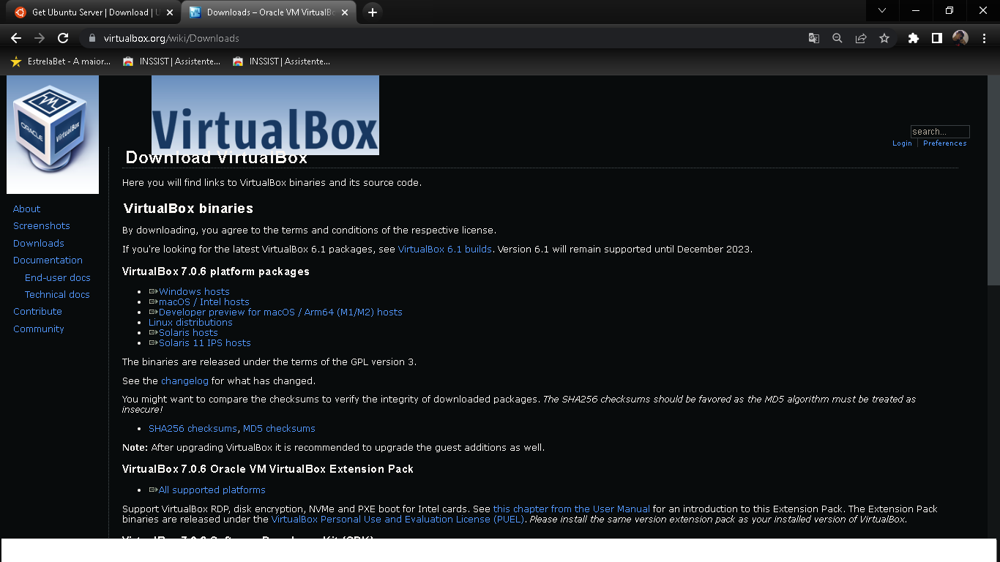
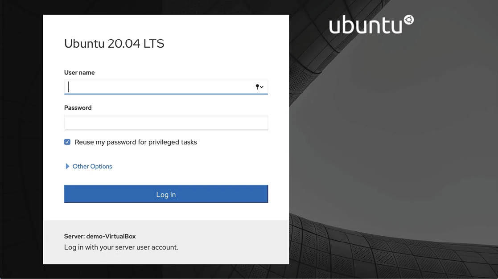

>  # Documentação de atividade 

>  ##  Objetivo
* Durante 18 dias de aula, aprendemos sobre diversas ferramentas e tecnologias. Começamos utilizando o sistema operacional Linux Ubuntu Server 
<a href="https://ubuntu.com/download/server"></a>
  versão mais recente (22.04)  que instalamos a ferramenta "Cockpit" instalada para gerenciamento da máquina via web através de conexão IP/Porta. Utilizamos o " Virtual Box" 
  <a href="https://www.virtualbox.org/wiki/Downloads"></a>
 um software com o objetivo de subir uma "VM (Virtual Machine)", optamos por utiliza-lo pois não podiamos utilizar tais ferramentas na maquina fisica que estavamos

* Em seguida, instalamos o Docker
   uma plataforma de containerização que permite empacotar, distribuir e executar aplicativos em ambientes isolados e independentes de infraestrutura. Utilizamos o Docker Compose para definir e executar aplicativos compostos por múltiplos containers com configurações de ambiente, porta, versão.

* Subimos três containers dentro do Docker-compose com diferentes aplicações: MySQL  para gerenciamento de banco de dados, Adminer para gerenciamento do banco de dados MySQL via web com ambiente gráfico, e Wordpress  um servidor web que utiliza um banco de dados.
---


> ## Download e instalações

## virtual box     <a href="https://www.virtualbox.org/wiki/Downloads"></a>

* Download Virtual Box (versão 7.0.6) para todos os sistemas operacionais.: 
>  <a href="https://www.virtualbox.org/wiki/Downloads"></a>

* Link de download direto à pagina.:

   > <a href="https://www.virtualbox.org/wiki/Downloads"></a>

---
## Ubuntu Server <a href="https://ubuntu.com/download/server"></a>
* Adquirição ISO utilizada (Imagem com link à  pagina).: Ubuntu Server (22.04).
> <a href="https://ubuntu.com/download/server"></a>
* Link download direto à pagina.:

    > <a href="https://ubuntu.com/download/server"></a>

---
## Tutorial instalação 
* Tutorial rapido de instalação VM (Virtual Machine) utilizando Virtual Box.: (Link direto na imagem) 

   >  <a href="https://tecnoblog.net/responde/como-criar-uma-maquina-virtual-virtualbox/"></a>
* Tutorial instalação em português Ubuntu Server 22.04.:
    > <a href="https://tiparaleigo.wordpress.com/2022/05/11/como-instalar-o-ubuntu-server-22-04-lts-passo-a-passo/"></a>
---

## Cockpit
* Para instalar o Cockpit no Ubuntu Server 22.04 via terminal, siga os seguintes passos:

1. Abra o terminal no seu Ubuntu Server.

2. Atualize a lista de pacotes disponíveis  executando o seguinte comando:

```
 sudo apt update
```
3. Instale o Cockpit usando o seguinte comando:
```
sudo apt install cockpit
```
4. Após a instalação ser concluída, você pode verificar se o serviço do Cockpit está em execução usando o seguinte comando:
```
systemctl status cockpit
``` 
5. Se o serviço estiver em execução, você pode acessar o Cockpit abrindo um navegador da web e digitando o endereço IP do seu servidor seguido de ":9090" na barra de endereço do navegador. Por exemplo, se o endereço IP do seu servidor for 192.168.1.100, digite o seguinte endereço na barra de endereço do navegador:
```
https://(Endereço IP de sua maquina):9090 (Porta 9090, porta padrão da ferramenta Cockpit).

Ex.: https://192.168.1.100:9090
```
6. Quando solicitado, faça login com as credenciais de usuário do seu servidor. Você agora deve estar conectado ao Cockpit e pode gerenciar seu servidor usando a interface web do Cockpit.

 *  Imagem exemplo:

---
 ## Docker 
 * Para instalar o Docker no Ubuntu Server 22.04, siga estas etapas:

 1. Atualize o índice do pacote apt digitando o seguinte comando no terminal:
 ```
sudo apt-get update
 ```
 2. Instale as dependências necessárias para o Docker usando o seguinte comando:
 ```
sudo apt-get install apt-transport-https ca-certificates curl gnupg-agent software-properties-common
 ```
 3. Adicione a chave GPG oficial do Docker usando o seguinte comando:
 ```
curl -fsSL https://download.docker.com/linux/ubuntu/gpg | sudo apt-key add -
 ```
 4. Adicione o repositório do Docker às fontes do APT usando o seguinte comando:
 ```
sudo add-apt-repository "deb [arch=amd64] https://download.docker.com/linux/ubuntu $(lsb_release -cs) stable"
 ```
 5. Atualize o índice do pacote apt novamente usando o seguinte comando:
  ```
sudo apt-get update
 ```
 6. Instale a versão mais recente do Docker Community Edition usando o seguinte comando:
 ```
sudo apt-get install docker-ce docker-ce-cli containerd.io
 ```
 Pronto! Agora você tem o Docker instalado no seu Ubuntu Server 22.04.

 Por boas praticas adicione o usuario de sua maquina ao grupo do Docker para evitar sempre utilizar o comando "sudo" para quaisquer execuções com o Docker, para isso utilize o comando.:
 1. Abra um terminal e digite o seguinte comando para adicionar o usuário ao grupo do Docker
 ```
sudo usermod -aG docker <nome_do_usuário>
 ```
Substitua <nome_do_usuário> pelo nome de usuário que deseja adicionar ao grupo do Docker.

2. Faça logout e login novamente para que as alterações entrem em vigor.

3. Para verificar se o usuário foi adicionado corretamente ao grupo do Docker, digite o seguinte comando no terminal:
```
groups <nome_do_usuário>
```
Este comando exibirá todos os grupos aos quais o usuário pertence, incluindo o grupo do Docker.
Pronto! Agora o usuário que você adicionou ao grupo do Docker tem permissão para executar comandos do Docker sem precisar de permissões de superusuário.
 ___

## Docker-compose

* Instalação Docker-compose. Docker Compose é uma ferramenta para definir e executar aplicativos Docker multicontêineres. Ele permite definir todo o ambiente de um aplicativo em um arquivo YAML, incluindo informações sobre imagens Docker, volumes, variáveis de ambiente, portas de rede, dependências entre contêineres e outras configurações.

1. Verifique a versão mais recente do Docker Compose disponível em https://github.com/docker/compose/releases. Copie o link para a versão mais recente do Docker Compose para o seu sistema.

2. No terminal, faça o download do Docker Compose mais recente com o seguinte comando:
```
sudo curl -L "https://github.com/docker/compose/releases/download/<VERSÃO MAIS RECENTE>/docker-compose-$(uname -s)-$(uname -m)" -o /usr/local/bin/docker-compose
```
Substitua <VERSÃO MAIS RECENTE> pelo número da versão que você copiou anteriormente.

3. Dê permissão de execução ao arquivo docker-compose com o seguinte comando:
```
sudo chmod +x /usr/local/bin/docker-compose
```

4. Verifique se o Docker Compose foi instalado corretamente digitando o seguinte comando:
```
docker-compose --version
```
Este comando exibirá a versão do Docker Compose instalada no seu sistema.
___
## Instalação de aplicações
* Instalação das seguintes aplicações: MySQL, Adminer e WordPress. As aplicações serão instaladas e subirão todas as 3 através do Docker-Compose com suas configurações de ambientes, portas, volumes e etcetera.

### MySQL    <a href="https://hub.docker.com/_/mysql"></a>
* Configuração de instalação de imagem e subida do containaer "MYSQL".:
```
version: '3.1'

services:
  db:
    image: mysql:latest
    restart: always
    ports:
      - "6556:3306"
    environment:
      MYSQL_DATABASE: loja  
      MYSQL_ROOT_PASSWORD: senac@123
    volumes:
      - ~/mysql-dados:/var/lib/mysql
    expose:
      - "3306"
```
> ###  Explicação:

* version: '3.1' indica a versão do docker-compose que estamos usando.

* services: indica a lista de serviços que queremos definir.

* db: é o nome do serviço que estamos definindo.
image: mysql:latest indica a imagem do Docker que usaremos para criar este serviço, com a versão mais recente.

* restart: always define que o serviço será sempre reiniciado em caso de falhas.

* ports: define as portas que devem ser expostas pelo serviço. No caso, a porta 3306 do MySQL é mapeada para a porta 6556 do host.

* environment: define as variáveis de ambiente do serviço, onde especificamos a senha para o usuário ROOT do MySQL.

* volumes: define os volumes que devem ser espelhados pelo serviço. No caso, o volume do MySQL será espelhado no caminho ~/mysql-dados.

* expose: define as portas que o serviço deve expor para outros serviços da mesma rede.
___

### Adminer
* Serviço "Adminer" uso com a seguinte inteção de gerenciar o banco de dados criado na dentação do serviço db chamado "loja" através de forma WEB. Configuração de imagem e container.:
```
adminer:
    image: adminer:latest
    ports:
      - "8084:8080"
```
* Exemplo do docker-compose.yml com dentação e configuração do momento atual.
```
version: '3.1'

services:
  db:
    image: mysql:latest
    restart: always
    ports:
      - "6556:3306"
    environment:
      MYSQL_ROOT_PASSWORD: senac@123
    volumes:
      - ~/mysql-dados:/var/lib/mysql
    expose:
      - "3306"

  adminer:
    image: adminer:latest
    restart: always
    ports:
      - "8084:8080"
    expose:
      - "8080"  
```
> Explicação:

* Adicionamos o serviço adminer no mesmo nível de indentação que o serviço db.

* Definimos a imagem do Docker para o serviço adminer como adminer:latest.

* Mapeamos a porta 8080 do contêiner Adminer para a porta 8084 do host, utilizando a opção ports.
___
### WordPress   <a href="https://hub.docker.com/_/wordpress"></a>
 * WordPress, uma ferramenta de servidor Web ligado a um banco de dados, a ferramenta só funciona se estiver interligada a um banco de dados, no caso da atividade a mesma foi funcionada de forma ao banco de dados criado dentro do MYSQL. Usaremos as configurações definidas anteriormente para configurar o WordPress para que tudo sejá interligado e não ocorra de causar erro.:
 ```
 wordpress:
    image: wordpress:latest
    restart: always
    ports:
      - "2332:80"
    environment:
      WORDPRESS_DB_HOST: db
      WORDPRESS_DB_USER: root
      WORDPRESS_DB_PASSWORD: senac@123
      WORDPRESS_DB_NAME: loja
      WORDPRESS_TABLE_PREFIX: pf
 ```
  * Por final, a configuração final do docker-compose.yml ficou da seguinte forma.:
 ```
version: '3.1'

services:
  db:
    image: mysql:latest
    restart: always
    ports:
      - "6556:3306"
    environment:
      MYSQL_ROOT_PASSWORD: senac@123
      MYSQL_DATABASE: loja
    volumes:
      - ~/mysql-dados:/var/lib/mysql
    expose:
      - "3306"

  adminer:
    image: adminer:latest
    ports:
      - "8084:8080"

  wordpress:
    image: wordpress:latest
    restart: always
    ports:
      - "2332:80"
    expose:
      - "80"  
    environment:
      WORDPRESS_DB_HOST: db
      WORDPRESS_DB_USER: root
      WORDPRESS_DB_PASSWORD: senac@123
      WORDPRESS_DB_NAME: loja
      WORDPRESS_TABLE_PREFIX: pf
 ```
>  Explicação:

* Adicionamos o serviço do WordPress ao arquivo docker-compose.yml.

* Definimos a imagem do Docker para o serviço do WordPress como wordpress:latest.

* Mapeamos a porta 80 do contêiner WordPress para a porta 2332 do host, utilizando a opção ports.

* Definimos o valor do ambiente WORDPRESS_DB_HOST como db, referenciando o nome do serviço do banco de dados criado anteriormente.

* Definimos o valor do ambiente WORDPRESS_DB_USER como root, correspondendo ao usuário do MySQL.

* Definimos o valor do ambiente WORDPRESS_DB_PASSWORD como senac@123, correspondendo à senha do usuário root do MySQL definida anteriormente.

* Definimos o valor do ambiente WORDPRESS_DB_NAME como loja, correspondendo ao nome do banco de dados criado anteriormente dentro do serviço do MySQL.

* Definimos o valor do ambiente WORDPRESS_TABLE_PREFIX como pf, correspondendo ao prefixo da tabela do WordPress.

* Adicionamos a opção restart: always para garantir que o serviço do WordPress seja sempre reiniciado automaticamente em caso de falhas.
___ 
> ### Execução
* Por final para subir os conteiner e as imagens configuradas dentro do "docker-compose.yml"
1. Abra um terminal na pasta onde está localizado o arquivo docker-compose.yml.
2. Execute o seguinte comando.:
```
docker-compose up
```
3. Aguarde até que os containers sejam criados e iniciados. Você poderá acompanhar o processo de criação dos containers e ver as mensagens de log diretamente no terminal.

4. Uma vez que todos os containers tenham sido iniciados, você poderá acessar a aplicação que está sendo executada no container do Wordpress acessando o endereço "http://localhost:2332" no seu navegador. (localhost = ip/endereço de sua maquina/servidor, porta 2332, porta criada para espelhar a porta 80 do WordPress). Executando esses seguintes passos você verá se as configurações e se o container subiu de forma positiva.

5. Poderá ver o estado dos seus containers da seguinte forma, no terminal de sua maquina utilize o seguinte comando.:
```
docker-compose ps -a
```
No comando dito, mostrará o estado do container, como nome do container, se está "up"/"ligado", nome da imagem, id do container.

* Se tudo ocorreu bem, você agora possui 3 containers com tais aplicações: Gerenciador de banco de dados (MySQL), gerenciador de banco de dados do MySQL via WEB (Adminer) e por final um servidor web interligado a um banco de dados (WordPress).
___
## Demonstração
>  ## Ubuntu Server 22.04:

___

> ## Cockpit:

___
> ## Docker (containers)

___
> ## Docker-compose (docker-compose.yml)

___
> ## MySQL

___
> ## Adminer

___
> ## WordPress

___
## Ferramentas utilizadas não citadas

* Ferramenta "vim", instalação no Ubuntu Server 22.04.:
```
sudo apt-get install vim
```
* Ferramenta "net-tools", instalação no Ubuntu Server 22.04.:
```
sudo apt-get install net-tools
```
### Utilização das tais ferramentais

> #### vim
* "vim" utilização de escrita em documento "touch", por exemplo para criar o arquivo "docker-compose.yml":
```
touch docker-compose.yml
```
* Para escrever dentro do arquivo criado:
```
vim docker-compose.yml
```
> #### net-toools
* Ferramenta "net-tools" serve-se para vc ter informações sobre sua placa de rede, como IP, nome e etcetera. Utilização:
```
ifconfig
```
* Dentro da mesma também pode-se modificar endereço ip colocando a mesma como estatica ou automatica, procure a fundo.
